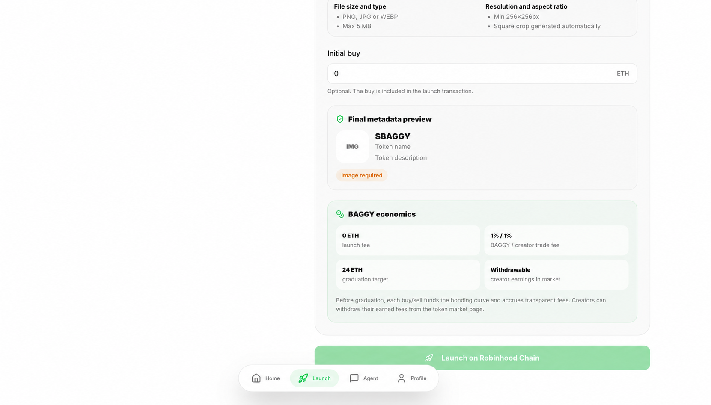
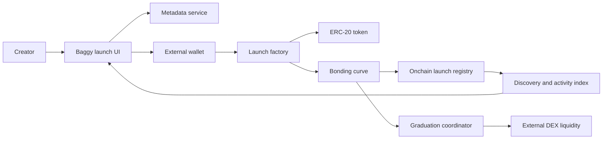
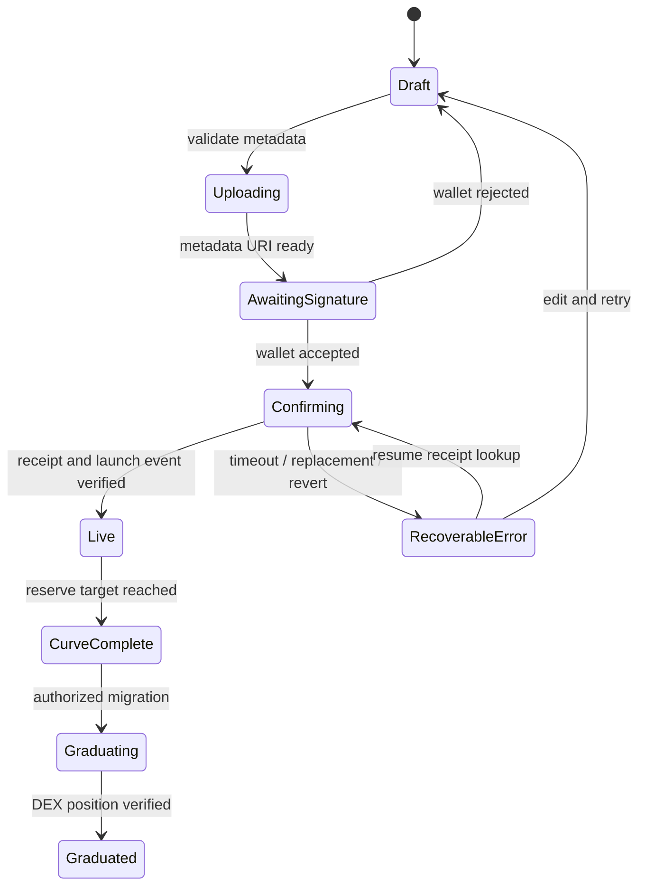
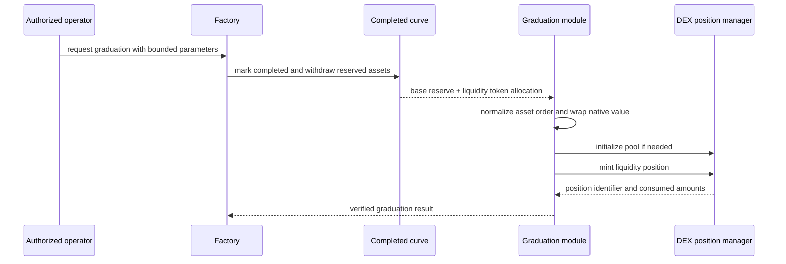

<div align="center">
  

# Baggy Launchpad Protocol

### From wallet intent to an onchain market in one transaction.

[Baggy product](https://baggyapp.win) · [Main Baggy case study](https://github.com/0xENTYPER/baggy)
</div>

Baggy Launchpad Protocol is the launch and early-liquidity system behind Baggy's EVM token workflow. It coordinates metadata preparation, wallet signing, atomic token deployment, curve trading, fee accounting, launch discovery, and eventual migration into external DEX liquidity.

> This repository is a public engineering case study. It contains architecture, sanitized interfaces, state models, and design rationale. Production contracts, addresses, provider configuration, deployment scripts, private economic parameters, and operational controls remain private.

## What problem it solves

Launching a token is not one isolated contract call. A usable product has to keep several boundaries consistent:

- creator metadata must remain attached to the correct token;
- wallet network, chain configuration, and contract deployment must agree;
- an optional creator purchase should not become a second fragile transaction;
- users need quotes and slippage limits before they sign;
- platform and creator fees must remain independently claimable;
- the interface must recover cleanly from rejection, replacement, reorg, or timeout;
- a completed launch must move into external liquidity without losing accounting integrity.

The protocol turns those concerns into one explicit lifecycle shared by contracts, client code, and product UI.

## Product context


The creator sees the token card and the form together. Name, ticker, description, social links, image readiness, and factory availability update the preview before a wallet signature is requested. Image validation and square cropping happen before the paid transaction path.



The final step keeps the optional initial buy and launch economics beside the metadata preview. This makes the creator's transaction intent, fee model, graduation target, and missing requirements visible before execution.

## System overview



### Responsibility boundaries

| Layer | Responsibility | Deliberately excluded |
| --- | --- | --- |
| Product UI | Metadata, validation, wallet readiness, visible progress | Custody and hidden signing |
| Wallet | Account ownership, network approval, transaction signature | Product state and indexing |
| Factory | Atomic deployment, launch registration, optional creator buy | Ongoing market execution |
| Curve | Quotes, buy/sell settlement, reserves, fees, completion state | Token metadata and UI concerns |
| Graduation module | Reserve handoff and DEX-liquidity creation | Pre-graduation trading |
| Discovery layer | Event reconciliation, metadata merge, status display | Source-of-truth accounting |

## Launch lifecycle



The UI does not treat a submitted transaction as success. A launch becomes live only after the expected receipt and launch event are reconciled.

## Core engineering decisions

### 1. Atomic token and market creation

The factory creates the token, creates its curve, initializes their relationship, records the launch, and optionally executes the creator's first purchase in one transaction.

**Why:** splitting this across several signatures creates partially configured tokens and forces the client to recover from every intermediate failure.

### 2. Contract quotes plus user slippage bounds

Buy and sell quotes come from the same reserve model used for settlement. The client converts the visible quote into a minimum output before asking the wallet to sign.

**Why:** the interface can explain expected output while the contract still enforces the user's worst acceptable result.

### 3. Pull-based fee accounting

Platform and creator fees accumulate in separate claimable balances. Settlement does not depend on an external recipient accepting funds during every trade.

**Why:** a failing recipient cannot block market activity, and each fee path can be reconciled independently.

### 4. Explicit graduation boundary

The curve stops normal trading before reserves and the liquidity allocation move to the graduation module. Migration is an authorized state transition, not an incidental side effect of a user's trade.

**Why:** reserve withdrawal, pool initialization, asset ordering, and position creation deserve their own failure and audit boundary.

### 5. Event-derived discovery with metadata fallbacks

The product discovers launches from factory events, then merges onchain state with cached and remote metadata. Contract identity always wins over presentation metadata.

**Why:** token cards stay usable when an image or metadata host is unavailable without inventing token identity.

## Public interface sketch

[`examples/public-interfaces.sol`](examples/public-interfaces.sol) shows the minimum public boundaries without implementation logic:

```solidity
interface ILaunchFactory {
    function launch(LaunchRequest calldata request)
        external
        payable
        returns (address token, address market);
}

interface ICurveMarket {
    function quoteBuy(uint256 valueIn) external view returns (uint256 tokensOut);
    function buy(uint256 minTokensOut) external payable returns (uint256 tokensOut);
    function sell(uint256 tokensIn, uint256 minValueOut) external returns (uint256 valueOut);
}
```

This is intentionally an interface example, not deployable contract source.

## Client transaction model

[`examples/launch-state.ts`](examples/launch-state.ts) demonstrates the state boundary used by the interface:

```ts
type LaunchPhase =
  | "draft"
  | "uploading"
  | "signing"
  | "confirming"
  | "success"
  | "error";
```

Each phase has a distinct UI message and available recovery action. Wallet rejection returns to an editable draft, while a submitted transaction keeps its hash so confirmation can resume after a reload.

## Graduation design



The position remains protocol-controlled in the current design. Fee collection is separate from graduation, making post-launch revenue observable without reopening the migration path.

## Safety model

The most important properties are behavioral, not cosmetic:

- no state-changing action happens without an external wallet signature;
- launch creation is disabled when chain configuration is incomplete;
- minimum-output checks protect both buy and sell execution;
- reserve-changing functions are reentrancy-protected;
- only the factory can initialize or finalize a curve;
- only an authorized operational role can trigger graduation;
- fee withdrawal follows checks-effects-interactions;
- unused graduation assets are accounted for explicitly;
- the UI never asks users to paste private keys.

The complete threat model is documented in [`docs/security-model.md`](docs/security-model.md).

## Verification strategy

The protocol is designed around tests that protect accounting and state transitions:

| Test layer | Examples |
| --- | --- |
| Unit | launch wiring, quote math, fee accrual, claim authorization |
| Boundary | zero input, minimum output, completed curve, duplicate graduation |
| Fuzz | reserve changes, buy/sell round trips, fee conservation |
| Invariant | assets remain accounted for across curve and graduation states |
| Integration | wallet rejection, replacement, confirmation, event decoding |
| Fork/testnet | DEX asset order, pool fee tier, position manager behavior |

See [`docs/testing-strategy.md`](docs/testing-strategy.md) for the proposed release gates.

## UI rationale

The launch interface follows the execution model instead of presenting one long form:

1. **Wallet readiness first.** There is no false sense of progress before the signer and network are usable.
2. **Metadata before signature.** Image and metadata failures stay outside the paid transaction path.
3. **One primary action per phase.** Upload, sign, confirm, and recovery are visually distinct.
4. **Persistent transaction context.** A submitted hash survives reloads and supports receipt recovery.
5. **Explorer as evidence.** Success links to verifiable chain state rather than relying on a toast.

## Repository map

```text
.
├── README.md
├── assets/
│   ├── launch-entry.png
│   ├── launch-economics.png
│   └── logo.png
├── docs/
│   ├── architecture.md
│   ├── security-model.md
│   └── testing-strategy.md
└── examples/
    ├── launch-state.ts
    └── public-interfaces.sol
```

## Current status

The production work includes the pre-graduation path and a configurable DEX graduation module. The contracts are not presented here as audited or permissionless production infrastructure. Mainnet activation requires exact-chain integration testing, economic review, independent contract review, monitoring, and explicit operational approval.

## Public repository scope

This repository does **not** publish:

- production Solidity implementations or deployment bytecode;
- contract addresses, private RPC routes, or provider credentials;
- deployment keys, wallet secrets, or administrative procedures;
- proprietary scoring, launch filters, or economic configuration;
- incident-response access or production monitoring details.

## Author

Built by [0xENTYPER](https://github.com/0xENTYPER).
