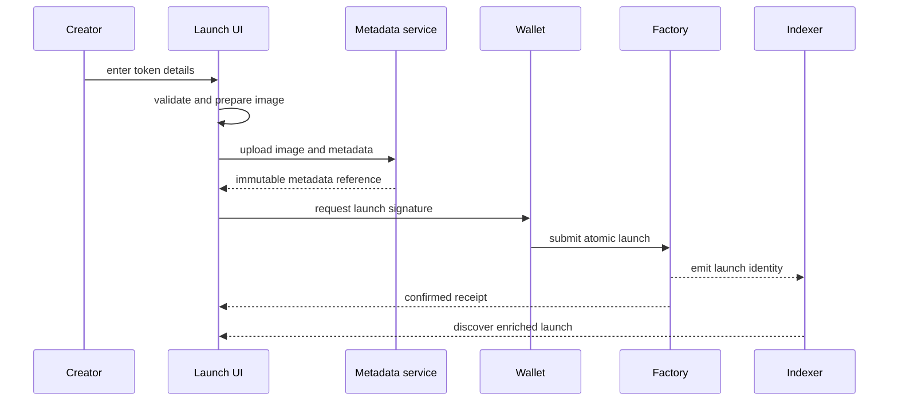

# Architecture

## Design goal

The launchpad is organized around one rule: every layer owns a small, explicit responsibility. Contracts own accounting and authorization; the wallet owns consent; the client owns presentation and recovery; indexing owns discoverability.

## Components

### Launch factory

The factory is the registry and deployment boundary. A launch request contains presentation-independent token fields, a metadata reference, creator identity, and optional initial purchase parameters. A successful call emits enough identity for an indexer to discover the token and market without trusting the client.

The factory also guards transitions that require protocol authority, including curve finalization and graduation-module invocation.

### Token

The token contract is intentionally narrow. Supply and allocation are established during creation, then the market and liquidity paths control how the allocated inventory enters circulation.

### Curve market

The curve owns pre-graduation pricing, reserve accounting, slippage checks, fee accrual, and the completed/graduated flags. Quote functions and execution share the same pricing model so the client does not reproduce financial logic independently.

### Graduation module

Graduation is isolated from the curve because it integrates with an external DEX and has a different risk profile. It receives only the assets reserved by a completed curve, normalizes token order, creates or finds the pool, and mints the protocol-controlled liquidity position.

### Client orchestration

The client prepares metadata before asking for a signature, encodes bounded parameters, records the submitted hash, waits for confirmation, validates emitted identity, and then opens the created token. It treats provider errors and wallet rejection as different recovery paths.

### Discovery

Factory events form the identity source. Discovery enriches those events with token metadata, reserve progress, and recent activity. Unavailable media degrades to a placeholder; it never causes a different token to be shown.

## Data flow

## Failure boundaries

| Failure | Owner | Recovery |
| --- | --- | --- |
| Invalid image or metadata | Client | Keep draft editable and retry upload |
| Wrong network | Wallet/client | Request network switch before encoding |
| User rejection | Wallet | Return to draft without an error-shaped success |
| Submitted but unknown receipt | Client/provider | Persist hash and resume lookup |
| Contract revert | Contract/client | Decode reason and restore actionable state |
| Metadata host unavailable | Discovery | Render verified identity with a placeholder |
| Graduation integration mismatch | Operations | Keep graduation disabled and preserve curve state |

## Why this separation matters

The system can change its metadata provider, indexer, or product UI without changing reserve accounting. Likewise, contract behavior can be tested independently of React rendering and wallet-provider timing. That separation is the main defense against a launch flow becoming one fragile cross-stack transaction script.
